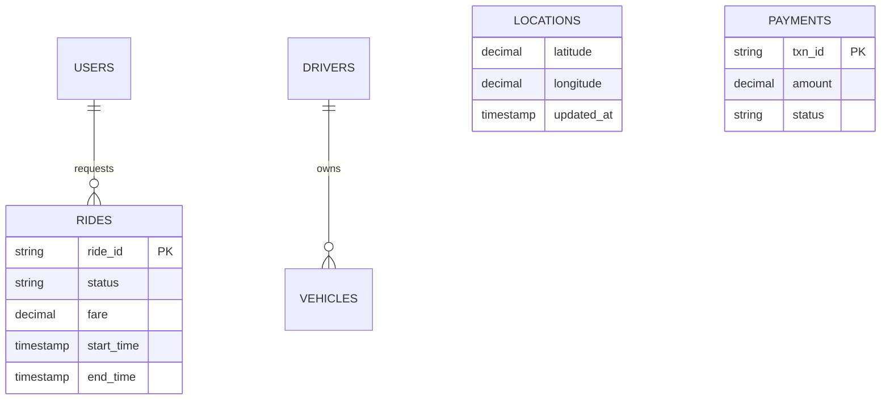
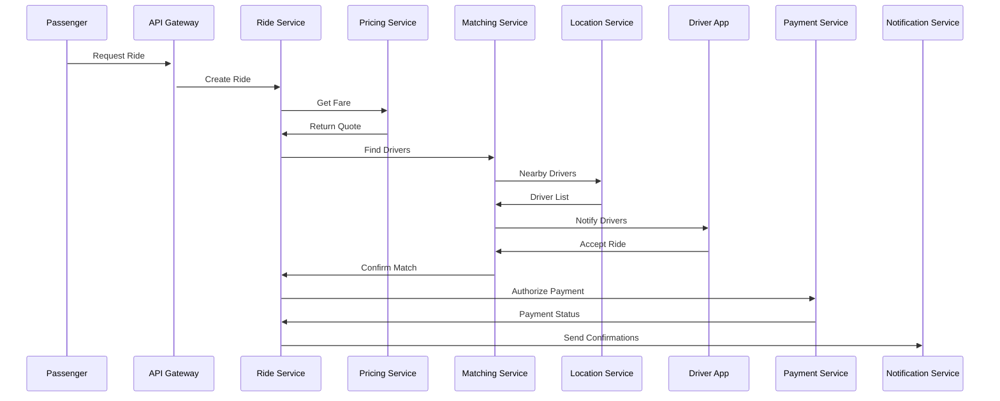
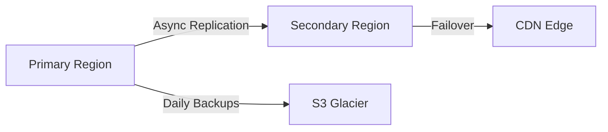

Here's the merged and enhanced system design incorporating elements from both versions:

# Ride-Booking System :oncoming_taxi:

[](https://opensource.org/licenses/MIT)
[](https://microservices.io)
[]()

## Project Overview
A scalable, microservices-based ride-booking system with real-time capabilities, combining the best features of a ride hailing system. This repository serves as the **central documentation hub** with links to individual service repositories.

### Core Features
| Passenger Features              | Driver Features                 | Admin Features                  |
|----------------------------------|----------------------------------|----------------------------------|
| Ride Booking & Scheduling        | Ride Request Management         | User/Driver Management          |
| Real-Time Driver Tracking        | Earnings & Ride History         | Fare & Pricing Configuration    |
| Fare Estimation                  | Navigation to Pickup            | Analytics & Reporting           |
| Multiple Payment Options         | Wait Time Charges               | Customer Support Tools          |
| Emergency SOS                    | Availability Toggle             | System Health Monitoring        |

---

## System Architecture
### High-Level Design

```mermaid
graph TD
    %% Client Layer
    PA[Passenger App] -->|HTTPS| AG[API Gateway]
    DA[Driver App] --> AG
    AP[Admin Panel] --> AG
    
    %% Service Layer
    AG -->|Auth| AS[Auth Service]
    AG --> RS[Ride Service]
    AG --> LS[Location Service]
    AG --> PS[Payment Service]
    AG --> DS[Driver Service]
    AG --> NS[Notification Service]
    
    %% Core Workflow
    RS --> RMS[Ride Matching Service]
    LS --> RMS
    RMS -->|Match| DS
    RS -->|Pricing| DPS[Dynamic Pricing Service]
    
    %% Data Layer
    PS --> PD[(Payment DB)]
    LS --> GD[(GeoDB)]
    RS --> RD[(Ride DB)]
    DS --> DD[(Driver DB)]
    
    %% External Services
    LS --> MP[Map Provider]
    PS --> PG[Payment Gateway]
    NS --> PN[Push Service]
    
    style AG fill:#4f0015,stroke:#fff
    style RS fill:#4f0015,stroke:#fff
```


### Enhanced Components

1. **Auth Service** (New)
   - JWT/OAuth2 authentication
   - Role-based access control
   - Session management

2. **Dynamic Pricing Service** (Enhanced)
   - Real-time surge pricing
   - Machine learning predictions
   ```python
   def calculate_fare(base, distance, time, surge):
       return (base + (distance * 1.5) + (time * 0.2)) * surge
   ```

3. **Driver Service** (Enhanced)
   - Driver profile management
   - Vehicle information
   - Availability status

4. **Analytics Service** (New)
   - Real-time dashboards
   - Ride pattern analysis
   - Fraud detection

---

## Technical Specifications

### Database Architecture


| Database       | Purpose                          | Technology     |
|----------------|----------------------------------|----------------|
| Ride DB        | Transactional data               | PostgreSQL     |
| GeoDB          | Location tracking                | Redis + PostGIS|
| Payment DB     | Financial transactions           | Cassandra      |
| Analytics DB   | Business intelligence            | TimescaleDB    |

---


Here is the **Repository Structure table**, along with its purpose, tech stack, and GitHub link:

---

## Repository Structure

| Service / App             | Purpose                                   | Tech Stack                          | GitHub Link |
|---------------------------|-------------------------------------------|-------------------------------------|-------------|
| **Passenger App**         | Mobile app for passengers to book rides, track drivers, and manage payments | Flutter / React Native, Maps API    | [Link](https://github.com/ByteBix-Projects/riders-mobile-app) |
| **Driver App**            | Mobile app for drivers to manage rides, navigation, and earnings            | Flutter / React Native, Maps API    | [Link](https://github.com/ByteBix-Projects/driver-app) |
| **Admin Panel**           | Web interface for managing users, drivers, payments, analytics, and support  | React.js, Node.js, PostgreSQL, JWT  | [Link](https://github.com/ByteBix-Projects/admin-panel) |
| API Gateway               | Central request router                    | NGINX, Node.js                      | [Link](https://github.com/ByteBix-Projects/api-gateway) |
| Auth Service              | Authentication & authorization            | Node.js, JWT, OAuth2                | [Link](https://github.com/ByteBix-Projects/auth-service) |
| Ride Service              | Ride lifecycle management                 | Go, PostgreSQL                      | [Link](https://github.com/ByteBix-Projects/ride-service) |
| Matching Service          | Driver-passenger matching logic           | Python, Redis, gRPC                 | [Link](https://github.com/ByteBix-Projects/matching-service) |
| Driver Service            | Driver management & availability          | Go, PostgreSQL                      | [Link](https://github.com/ByteBix-Projects/driver-service) |
| Location Service          | Real-time GPS tracking                    | Python, Redis                       | [Link](https://github.com/ByteBix-Projects/location-service) |
| Payment Service           | Transaction processing                    | Node.js, Stripe                     | [Link](https://github.com/ByteBix-Projects/payment-service) |
| Dynamic Pricing Service   | Surge pricing engine                      | Python, MLflow                      | [Link](https://github.com/ByteBix-Projects/pricing-service) |
| Notification Service      | Real-time alerts & notifications          | Go, Kafka                           | [Link](https://github.com/ByteBix-Projects/notification-service) |
| Analytics Service         | Dashboards, reporting, BI                 | Python, TimescaleDB, Grafana        | [Link](https://github.com/ByteBix-Projects/analytics-service) |


---

## Key Workflows

### Ride Booking Sequence


---

## Operational Excellence

### Monitoring Stack
| Metric                | Tool          | Alert Threshold |
|-----------------------|---------------|-----------------|
| API Latency           | Prometheus    | >500ms p95      |
| Error Rate            | Grafana       | >1%             |
| Payment Success       | Datadog       | <99%            |
| Driver Response Time  | New Relic     | >30s            |

### Disaster Recovery


- RTO: 15 minutes
- RPO: 5 minutes
- Multi-AZ deployment

---

## Security Measures

1. **Data Protection**
   - AES-256 encryption at rest
   - TLS 1.3 for all communications
   - PCI-DSS compliance for payments

2. **Access Control**
   - RBAC with JWT claims
   - Vault for secret management
   - Biometric authentication

3. **Fraud Prevention**
   - Velocity checking
   - ML-based anomaly detection
   - Driver rating system

---

## Getting Started

### Local Development
```bash
# Clone sample service
git clone https://github.com/ByteBix-Projects/ride-service.git
cd ride-service
.......
.......
```

### Production Deployment
```bash
.......
.......
```

---

## Contribution Guidelines

1. **Branch Strategy**
   - `main`: Production releases
   - `staging`: Pre-production testing
   - `feature/*`: New developments

2. **Code Standards**
   - 90% test coverage
   - SonarQube static analysis
   - Conventional commits

---

## License
MIT License - See [LICENSE](LICENSE) for details.

---

## Contact
[Project Board](https://github.com/ByteBix-Projects/ride-booking/projects) | 
[Slack Channel](https://bytebix.slack.com) | 
[Email Support](mailto:dev-support@bytebixtechnologies.com)

