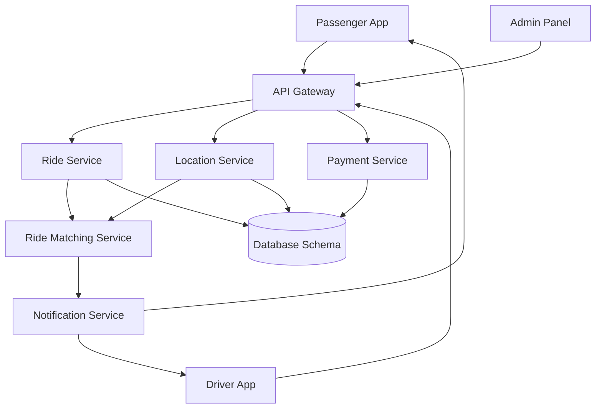

# Ride-Booking System :oncoming_taxi:

A scalable, microservices-based ride-booking system inspired by platforms like Uber and Ola. This repository serves as the **central documentation hub** for the entire project, explaining its architecture, components, and workflows. For code, see the individual service repositories linked below.

[](https://opensource.org/licenses/MIT)
[](https://microservices.io)
[]()

## Project Overview
This system is designed to handle real-time ride booking, driver-passenger matching, payment processing, and analytics. It follows a **domain-driven microservices architecture** to ensure scalability, fault tolerance, and maintainability.

### Core Features
| Passenger Features              | Driver Features                 | Admin Features                  |
|----------------------------------|----------------------------------|----------------------------------|
| Ride Booking & Scheduling        | Ride Request Management         | User/Driver Management          |
| Real-Time Driver Tracking        | Earnings & Ride History         | Fare & Pricing Configuration    |
| Fare Estimation                  | Navigation to Pickup            | Analytics & Reporting           |
| Multiple Payment Options         | Wait Time Charges               | Customer Support Tools          |
| Emergency SOS                    | Availability Toggle             | System Health Monitoring        |

---

## System Architecture
### High-Level Design


### Key Components
1. **API Gateway**: Central entry point for all client requests (Passenger/Driver Apps, Admin Panel).
2. **Ride Service**: Manages ride lifecycle (booking, fare calculation, status updates).
3. **Location Service**: Handles real-time GPS tracking and geospatial data.
4. **Ride Matching Service**: Matches riders with nearby drivers using proximity algorithms.
5. **Payment Service**: Processes payments and refunds via Stripe/PayPal integration.
6. **Notification Service**: Sends push/SMS alerts for ride updates.
7. **Database Schema**: PostgreSQL (relational data) + Redis (caching) + Cassandra (analytics).

---

## Repository Structure
The system is divided into 10 repositories, each focusing on a specific domain:

| Repository                  | Purpose                          | Tech Stack                     |
|-----------------------------|----------------------------------|--------------------------------|
| [passenger-app](https://github.com/ByteBix-Projects/passenger-app) | Passenger-facing mobile app      | React Native, Google Maps API  |
| [driver-app](https://github.com/ByteBix-Projects/driver-app)       | Driver-facing mobile app         | Flutter, Mapbox                |
| [admin-panel](https://github.com/ByteBix-Projects/admin-panel)     | Web-based admin dashboard         | React.js, Node.js              |
| [api-gateway](https://github.com/ByteBix-Projects/api-gateway)     | Central request router            | NGINX, Node.js, JWT            |
| [ride-service](https://github.com/ByteBix-Projects/ride-service)   | Ride lifecycle management         | Go, PostgreSQL, Redis          |
| [location-service](https://github.com/ByteBix-Projects/location-service) | Real-time tracking & geodata     | Python, PostGIS, Redis         |
| [ride-matching-service](https://github.com/ByteBix-Projects/ride-matching-service) | Driver-passenger matching        | Java, Spring Boot, Redis       |
| [payment-service](https://github.com/ByteBix-Projects/payment-service) | Payment processing               | Node.js, Stripe, PostgreSQL    |
| [notification-service](https://github.com/ByteBix-Projects/notification-service) | Alerts & notifications           | Python, Firebase, Celery       |
| [database-schema](https://github.com/ByteBix-Projects/database-schema) | Database structure & migrations   | PostgreSQL, Cassandra, SQLAlchemy |

---

## Getting Started
### Prerequisites
- Docker >= 20.10
- Kubernetes (for production deployment)
- Node.js 18.x / Go 1.21 / Python 3.11

### Local Setup (Example: Ride Service)
```
git clone https://github.com/ByteBix-Projects/ride-service.git
cd ride-service
docker-compose up -d # Starts PostgreSQL and Redis
go run main.go
```

---

## Contribution Guidelines
1. **Fork** the repository you want to contribute to.
2. Create a **feature branch**:  
   `git checkout -b feat/your-feature-name`
3. Follow the [Conventional Commits](https://www.conventionalcommits.org/) standard.
4. Open a **Pull Request** with a detailed description of changes.

---

## License
This project is licensed under the MIT License. See [LICENSE](LICENSE) for details.

---

## Contact
For questions or collaborations, contact [Project Lead](mailto:contact@bytebixtechnologies.com) or join our [Slack Channel](https://bytebix.slack.com).

